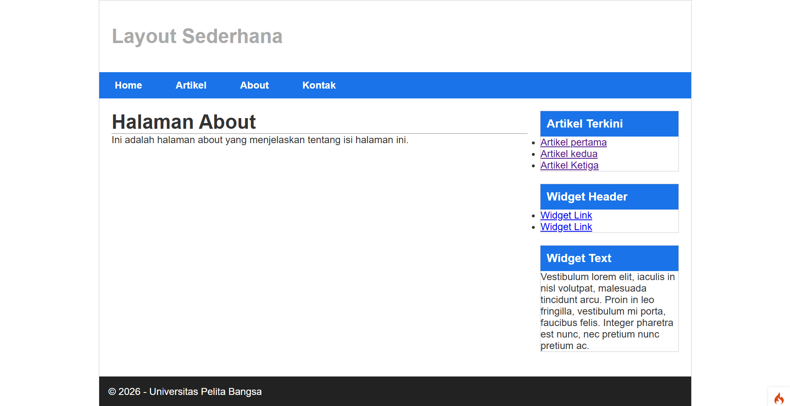
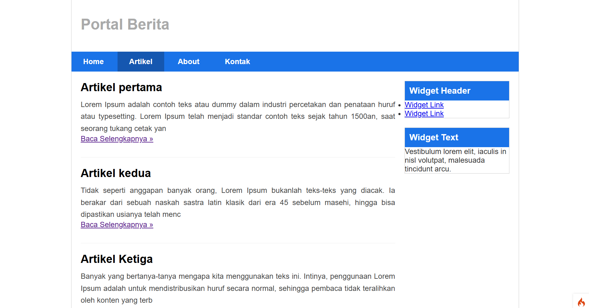
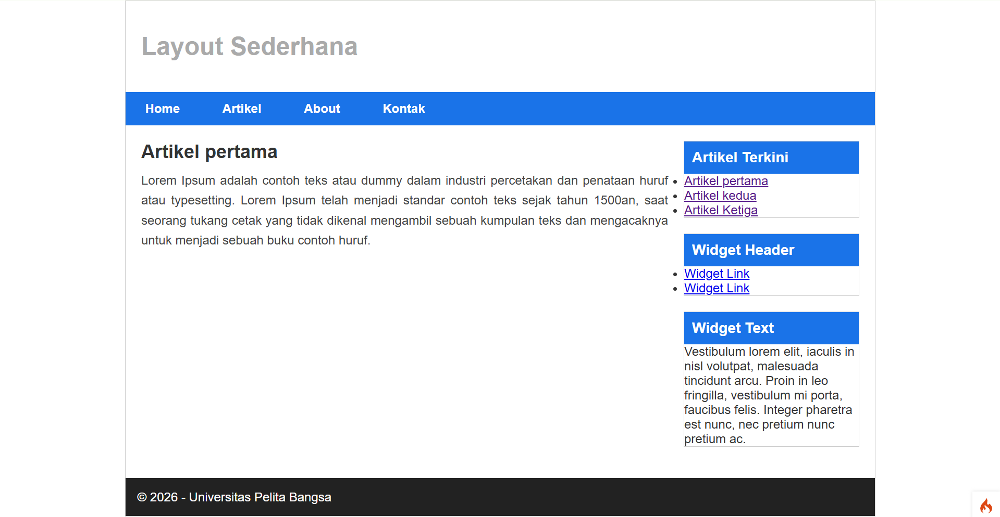
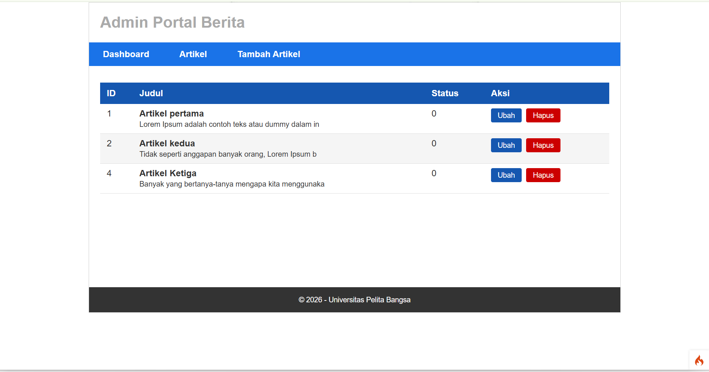
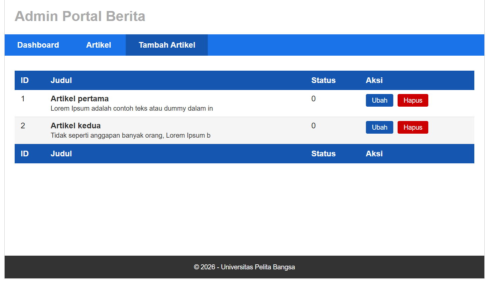
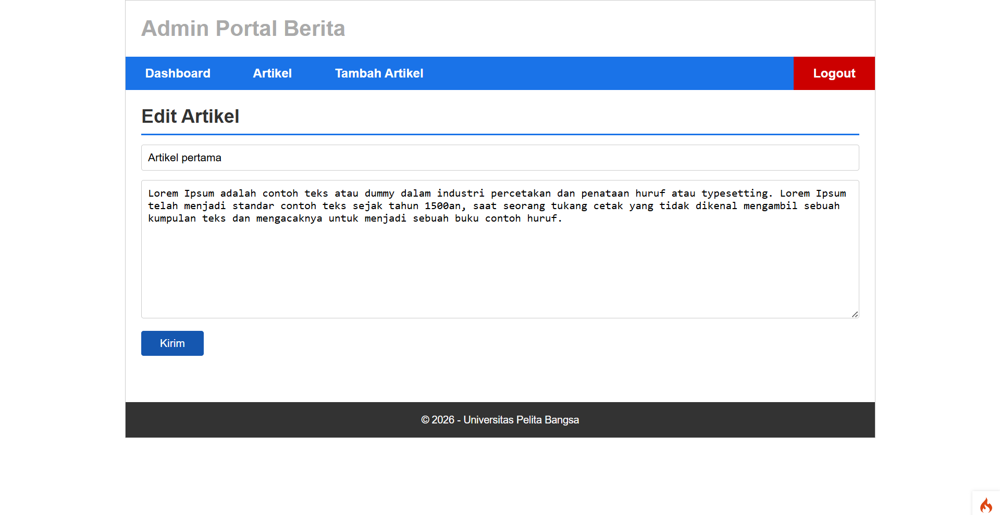
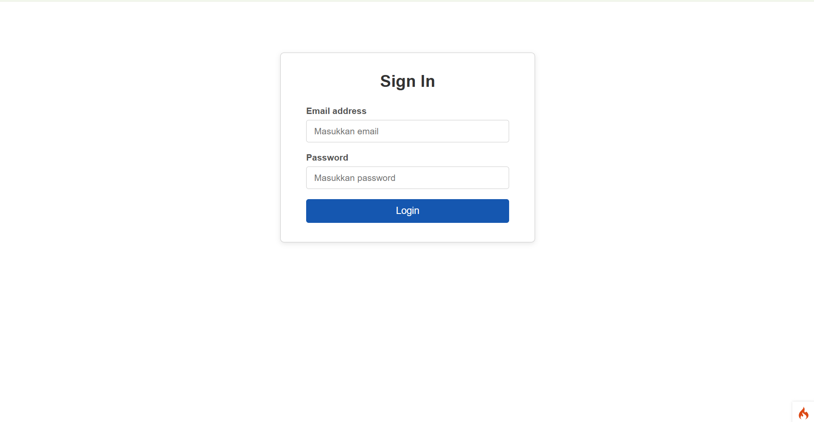

# Lab7Web - Praktikum Pemrograman Web 2
## Framework CodeIgniter 4
**Nama:** Afdhal Agislam  
**NIM:** 312410445  
**Kelas:** I241E 

### Universitas Pelita Bangsa

---

# CodeIgniter 4 Framework

## What is CodeIgniter?

CodeIgniter is a PHP full-stack web framework that is light, fast, flexible and secure.
More information can be found at the [official site](https://codeigniter.com).

This repository holds the distributable version of the framework.
It has been built from the
[development repository](https://github.com/codeigniter4/CodeIgniter4).

More information about the plans for version 4 can be found in [CodeIgniter 4](https://forum.codeigniter.com/forumdisplay.php?fid=28) on the forums.

You can read the [user guide](https://codeigniter.com/user_guide/)
corresponding to the latest version of the framework.

## Important Change with index.php

`index.php` is no longer in the root of the project! It has been moved inside the *public* folder,
for better security and separation of components.

This means that you should configure your web server to "point" to your project's *public* folder, and
not to the project root. A better practice would be to configure a virtual host to point there. A poor practice would be to point your web server to the project root and expect to enter *public/...*, as the rest of your logic and the
framework are exposed.

**Please** read the user guide for a better explanation of how CI4 works!

## Repository Management

We use GitHub issues, in our main repository, to track **BUGS** and to track approved **DEVELOPMENT** work packages.
We use our [forum](http://forum.codeigniter.com) to provide SUPPORT and to discuss
FEATURE REQUESTS.

This repository is a "distribution" one, built by our release preparation script.
Problems with it can be raised on our forum, or as issues in the main repository.

## Contributing

We welcome contributions from the community.

Please read the [*Contributing to CodeIgniter*](https://github.com/codeigniter4/CodeIgniter4/blob/develop/CONTRIBUTING.md) section in the development repository.

## Server Requirements

PHP version 8.2 or higher is required, with the following extensions installed:

- [intl](http://php.net/manual/en/intl.requirements.php)
- [mbstring](http://php.net/manual/en/mbstring.installation.php)

> [!WARNING]
> - The end of life date for PHP 7.4 was November 28, 2022.
> - The end of life date for PHP 8.0 was November 26, 2023.
> - The end of life date for PHP 8.1 was December 31, 2025.
> - If you are still using below PHP 8.2, you should upgrade immediately.
> - The end of life date for PHP 8.2 will be December 31, 2026.

Additionally, make sure that the following extensions are enabled in your PHP:

- json (enabled by default - don't turn it off)
- [mysqlnd](http://php.net/manual/en/mysqlnd.install.php) if you plan to use MySQL
- [libcurl](http://php.net/manual/en/curl.requirements.php) if you plan to use the HTTP\CURLRequest library

## Praktikum 1: PHP Framework (CodeIgniter)

### Tujuan
Memahami konsep dasar Framework, konsep MVC, dan membuat program sederhana menggunakan CodeIgniter 4.

### Persiapan
Sebelum memulai, beberapa ekstensi PHP perlu diaktifkan melalui XAMPP Control Panel pada bagian Apache → Config → PHP.ini. Ekstensi yang diaktifkan meliputi php-json, php-mysqlnd, php-xml, php-intl, dan libcurl. Setelah mengaktifkan ekstensi, Apache perlu di-restart agar perubahan berlaku.

### Instalasi CodeIgniter 4
CodeIgniter 4 diunduh dari website resmi https://codeigniter.com/download kemudian diekstrak ke direktori htdocs dengan nama folder lab11_php_ci. Folder framework diubah namanya menjadi ci4. Aplikasi dapat diakses melalui browser dengan alamat http://localhost/lab11_php_ci/ci4/public/.

### Mode Debugging
CodeIgniter 4 menyediakan fitur debugging yang secara default belum aktif. Untuk mengaktifkannya, file env diubah namanya menjadi .env kemudian nilai variabel CI_ENVIRONMENT diubah menjadi development. Dengan mode ini, pesan error akan ditampilkan secara detail sehingga memudahkan proses pengembangan.

### Konsep MVC
CodeIgniter 4 menggunakan arsitektur MVC (Model-View-Controller) yang memisahkan kode program berdasarkan fungsinya:
- **Model** bertugas mengelola data dan berinteraksi dengan database
- **View** bertugas menampilkan antarmuka kepada pengguna
- **Controller** bertugas sebagai penghubung antara Model dan View, menerima request dan mengembalikan response

### Routing dan Controller
Routing diatur melalui file app/Config/Routes.php yang menentukan Controller mana yang merespon sebuah request. Controller Page dibuat dengan beberapa method yaitu about(), contact(), dan faqs() untuk menangani halaman-halaman statis.

### Membuat Layout dengan CSS
File CSS disimpan di direktori public dengan nama style.css. Template layout dibagi menjadi dua file parsial yaitu header.php dan footer.php yang disimpan di direktori app/Views/template/. Setiap halaman view kemudian memanggil kedua file tersebut menggunakan fungsi include.

---

## Praktikum 2: Framework Lanjutan (CRUD)

### Tujuan
Memahami konsep dasar Model, konsep CRUD, dan membuat aplikasi CRUD sederhana menggunakan CodeIgniter 4.

### Persiapan Database
Database dibuat dengan nama lab_ci4 menggunakan MySQL. Di dalamnya dibuat tabel artikel dengan field id, judul, isi, gambar, status, dan slug. Konfigurasi koneksi database dilakukan melalui file .env dengan mengisi nilai hostname, database, username, password, dan DBDriver.

### ArtikelModel
Model dibuat di direktori app/Models dengan nama ArtikelModel.php. Model ini mewarisi class CodeIgniter\Model dan mendefinisikan tabel yang digunakan, primary key, dan field yang diizinkan untuk diisi (allowedFields).

### Controller Artikel
Controller Artikel dibuat dengan beberapa method:
- **index()** menampilkan semua data artikel dari database menggunakan method findAll() dan meneruskannya ke view
- **view($slug)** menampilkan detail artikel berdasarkan slug yang diterima dari URL
- **admin_index()** menampilkan daftar artikel dalam tampilan admin dengan tabel
- **add()** menangani proses penambahan artikel baru dengan validasi input
- **edit($id)** menangani proses pengubahan data artikel yang sudah ada
- **delete($id)** menangani proses penghapusan artikel dari database

### View Artikel
View untuk halaman publik menampilkan daftar artikel beserta cuplikan isi dan tombol Baca Selengkapnya. View detail menampilkan isi lengkap artikel. View admin menampilkan tabel dengan kolom ID, Judul, Status, dan Aksi yang berisi tombol Ubah dan Hapus.

### Template Admin
Template admin dibuat terpisah dari template publik. Admin header dan admin footer tidak menggunakan sidebar sehingga konten admin dapat ditampilkan secara full-width. Navigasi admin berisi menu Dashboard, Artikel, dan Tambah Artikel.

### Routing
Routing dibagi menjadi dua kelompok yaitu route publik untuk halaman yang dapat diakses semua pengunjung, dan route admin yang dikelompokkan menggunakan method group() untuk pengelolaan artikel.

---

## Praktikum 3: View Layout dan View Cell

### Tujuan
Memahami konsep View Layout dan View Cell di CodeIgniter 4 serta mengimplementasikannya untuk membuat tampilan yang modular dan dapat digunakan ulang.

### View Layout
View Layout adalah fitur CodeIgniter 4 yang memungkinkan pembuatan template induk yang dapat digunakan oleh banyak halaman. Layout utama dibuat di app/Views/layout/main.php yang berisi struktur HTML lengkap termasuk header, navigasi, sidebar, dan footer.

Setiap halaman yang menggunakan layout ini cukup mendeklarasikan:
- `$this->extend('layout/main')` untuk memberitahu CI4 bahwa halaman ini menggunakan layout tersebut
- `$this->section('content')` dan `$this->endSection()` untuk mendefinisikan konten yang akan dimasukkan ke dalam layout

Manfaat utama penggunaan View Layout adalah efisiensi kode karena perubahan tampilan cukup dilakukan di satu file layout tanpa harus mengubah setiap halaman satu per satu. Ini berbeda dengan pendekatan sebelumnya yang menggunakan include parsial di setiap view.

### View Cell
View Cell adalah komponen UI yang bersifat mandiri dan dapat dipanggil dari mana saja termasuk dari dalam layout. Berbeda dengan View biasa yang hanya menampilkan data yang dikirim dari Controller, View Cell dapat mengambil datanya sendiri langsung dari Model tanpa bergantung pada Controller.

Class ArtikelTerkini dibuat di direktori app/Cells/ yang bertugas mengambil 5 artikel terbaru dari database berdasarkan kolom created_at secara descending. Hasilnya kemudian diteruskan ke view komponen yang menampilkan daftar link artikel terkini di sidebar.

Untuk mendukung fitur ini, kolom created_at ditambahkan ke tabel artikel di database agar data dapat diurutkan berdasarkan waktu publikasi.

### Perbedaan View Cell dan View Biasa
View biasa hanya dapat menampilkan data yang secara eksplisit dikirimkan dari Controller melalui parameter view(). Sementara View Cell adalah komponen yang mandiri — ia memiliki logika sendiri untuk mengambil data dari Model dan menghasilkan output HTML yang siap ditampilkan. View Cell cocok digunakan untuk elemen yang muncul di banyak halaman seperti widget sidebar, menu navigasi dinamis, atau statistik yang selalu diperbarui.

---

## Praktikum 4: Framework Lanjutan (Modul Login)

### Tujuan
Memahami konsep Auth dan Filter, konsep Login System, dan membuat modul login menggunakan CodeIgniter 4.

### Persiapan Database
Tabel user dibuat di database lab_ci4 dengan field id, username, useremail, dan userpassword. Password disimpan dalam bentuk hash menggunakan fungsi password_hash() dengan algoritma PASSWORD_DEFAULT untuk keamanan.

### UserModel
Model untuk tabel user dibuat di app/Models/UserModel.php dengan mendefinisikan tabel, primary key, dan allowedFields yang berisi username, useremail, dan userpassword.

### Controller User
Controller User memiliki tiga method utama:
- **login()** menerima input email dan password dari form, memverifikasi kredensial menggunakan password_verify(), dan menyimpan data sesi jika login berhasil. Jika gagal, pesan error ditampilkan melalui flashdata
- **logout()** menghancurkan sesi yang aktif menggunakan session()->destroy() dan mengarahkan pengguna kembali ke halaman login
- **index()** menampilkan daftar semua user yang terdaftar

### View Login
Halaman login dirancang dengan tampilan yang bersih dan terpusat. Form login memiliki field email dan password, serta menampilkan pesan error jika kredensial yang dimasukkan salah. Pesan error ditampilkan menggunakan mekanisme flashdata dari session CodeIgniter.

### Database Seeder
Database Seeder digunakan untuk mengisi data awal ke dalam database secara otomatis. UserSeeder dibuat menggunakan perintah php spark make:seeder UserSeeder melalui XAMPP Shell, kemudian dijalankan dengan php spark db:seed UserSeeder. Seeder ini memasukkan satu data admin dengan email admin@email.com dan password admin123 yang sudah di-hash.

### Auth Filter
Filter Auth dibuat di app/Filters/Auth.php yang berfungsi memeriksa apakah pengguna sudah login sebelum mengakses halaman admin. Jika sesi logged_in tidak ditemukan, pengguna akan diarahkan ke halaman login secara otomatis. Filter ini didaftarkan di app/Config/Filters.php dengan alias auth.

### Implementasi Filter pada Route
Route admin diproteksi menggunakan filter auth dengan menambahkan parameter filter pada method group(). Dengan demikian, setiap akses ke URL yang diawali /admin/ akan melalui pengecekan Auth Filter terlebih dahulu sebelum Controller dieksekusi.

### Fungsi Logout
Tombol Logout ditambahkan di navigasi halaman admin. Ketika diklik, sesi akan dihancurkan sepenuhnya dan pengguna diarahkan kembali ke halaman login, sehingga akses ke halaman admin tidak dapat dilakukan tanpa login ulang.

---

## Screenshot Hasil Praktikum

---

**Layout Sederhana dengan CSS**

**Tampilan Daftar Artikel (Publik)**

**Tampilan Detail Artikel**

**Halaman Admin - Daftar Artikel**

**Halaman Admin - Tambah Artikel**

**Halaman Admin - Edit Artikel**

**Halaman Login**

