# Praktikum 1-14 - Pemrograman Web 2

## 👤 Identitas Mahasiswa
 
| | |
|---|---|
| Nama | Afdhal Agislam |
| NIM | 312410445 |
| Kelas | I241E |
| Mata Kuliah | Pemrograman Web 2 |

### Universitas Pelita Bangsa

---

# CodeIgniter 4 Framework

## What is CodeIgniter?

CodeIgniter is a PHP full-stack web framework that is light, fast, flexible and secure.
More information can be found at the [official site](https://codeigniter.com).

This repository holds the distributable version of the framework.
It has been built from the
[development repository](https://github.com/codeigniter4/CodeIgniter4).

More information about the plans for version 4 can be found in [CodeIgniter 4](https://forum.codeigniter.com/forumdisplay.php?fid=28) on the forums.

You can read the [user guide](https://codeigniter.com/user_guide/)
corresponding to the latest version of the framework.

## Important Change with index.php

`index.php` is no longer in the root of the project! It has been moved inside the *public* folder,
for better security and separation of components.

This means that you should configure your web server to "point" to your project's *public* folder, and
not to the project root. A better practice would be to configure a virtual host to point there. A poor practice would be to point your web server to the project root and expect to enter *public/...*, as the rest of your logic and the
framework are exposed.

**Please** read the user guide for a better explanation of how CI4 works!

## Repository Management

We use GitHub issues, in our main repository, to track **BUGS** and to track approved **DEVELOPMENT** work packages.
We use our [forum](http://forum.codeigniter.com) to provide SUPPORT and to discuss
FEATURE REQUESTS.

This repository is a "distribution" one, built by our release preparation script.
Problems with it can be raised on our forum, or as issues in the main repository.

## Contributing

We welcome contributions from the community.

Please read the [*Contributing to CodeIgniter*](https://github.com/codeigniter4/CodeIgniter4/blob/develop/CONTRIBUTING.md) section in the development repository.

## Server Requirements

PHP version 8.2 or higher is required, with the following extensions installed:

- [intl](http://php.net/manual/en/intl.requirements.php)
- [mbstring](http://php.net/manual/en/mbstring.installation.php)

> [!WARNING]
> - The end of life date for PHP 7.4 was November 28, 2022.
> - The end of life date for PHP 8.0 was November 26, 2023.
> - The end of life date for PHP 8.1 was December 31, 2025.
> - If you are still using below PHP 8.2, you should upgrade immediately.
> - The end of life date for PHP 8.2 will be December 31, 2026.

Additionally, make sure that the following extensions are enabled in your PHP:

- json (enabled by default - don't turn it off)
- [mysqlnd](http://php.net/manual/en/mysqlnd.install.php) if you plan to use MySQL
- [libcurl](http://php.net/manual/en/curl.requirements.php) if you plan to use the HTTP\CURLRequest library

## Praktikum 1: PHP Framework (CodeIgniter)

### Tujuan
Memahami konsep dasar Framework, konsep MVC, dan membuat program sederhana menggunakan CodeIgniter 4.

### Persiapan
Sebelum memulai, beberapa ekstensi PHP perlu diaktifkan melalui XAMPP Control Panel pada bagian Apache → Config → PHP.ini. Ekstensi yang diaktifkan meliputi php-json, php-mysqlnd, php-xml, php-intl, dan libcurl. Setelah mengaktifkan ekstensi, Apache perlu di-restart agar perubahan berlaku.

### Instalasi CodeIgniter 4
CodeIgniter 4 diunduh dari website resmi https://codeigniter.com/download kemudian diekstrak ke direktori htdocs dengan nama folder lab11_php_ci. Folder framework diubah namanya menjadi ci4. Aplikasi dapat diakses melalui browser dengan alamat http://localhost/lab11_php_ci/ci4/public/.

### Mode Debugging
CodeIgniter 4 menyediakan fitur debugging yang secara default belum aktif. Untuk mengaktifkannya, file env diubah namanya menjadi .env kemudian nilai variabel CI_ENVIRONMENT diubah menjadi development. Dengan mode ini, pesan error akan ditampilkan secara detail sehingga memudahkan proses pengembangan.

### Konsep MVC
CodeIgniter 4 menggunakan arsitektur MVC (Model-View-Controller) yang memisahkan kode program berdasarkan fungsinya:
- **Model** bertugas mengelola data dan berinteraksi dengan database
- **View** bertugas menampilkan antarmuka kepada pengguna
- **Controller** bertugas sebagai penghubung antara Model dan View, menerima request dan mengembalikan response

### Routing dan Controller
Routing diatur melalui file app/Config/Routes.php yang menentukan Controller mana yang merespon sebuah request. Controller Page dibuat dengan beberapa method yaitu about(), contact(), dan faqs() untuk menangani halaman-halaman statis.

### Membuat Layout dengan CSS
File CSS disimpan di direktori public dengan nama style.css. Template layout dibagi menjadi dua file parsial yaitu header.php dan footer.php yang disimpan di direktori app/Views/template/. Setiap halaman view kemudian memanggil kedua file tersebut menggunakan fungsi include.

---

## Praktikum 2: Framework Lanjutan (CRUD)

### Tujuan
Memahami konsep dasar Model, konsep CRUD, dan membuat aplikasi CRUD sederhana menggunakan CodeIgniter 4.

### Persiapan Database
Database dibuat dengan nama lab_ci4 menggunakan MySQL. Di dalamnya dibuat tabel artikel dengan field id, judul, isi, gambar, status, dan slug. Konfigurasi koneksi database dilakukan melalui file .env dengan mengisi nilai hostname, database, username, password, dan DBDriver.

### ArtikelModel
Model dibuat di direktori app/Models dengan nama ArtikelModel.php. Model ini mewarisi class CodeIgniter\Model dan mendefinisikan tabel yang digunakan, primary key, dan field yang diizinkan untuk diisi (allowedFields).

### Controller Artikel
Controller Artikel dibuat dengan beberapa method:
- **index()** menampilkan semua data artikel dari database menggunakan method findAll() dan meneruskannya ke view
- **view($slug)** menampilkan detail artikel berdasarkan slug yang diterima dari URL
- **admin_index()** menampilkan daftar artikel dalam tampilan admin dengan tabel
- **add()** menangani proses penambahan artikel baru dengan validasi input
- **edit($id)** menangani proses pengubahan data artikel yang sudah ada
- **delete($id)** menangani proses penghapusan artikel dari database

### View Artikel
View untuk halaman publik menampilkan daftar artikel beserta cuplikan isi dan tombol Baca Selengkapnya. View detail menampilkan isi lengkap artikel. View admin menampilkan tabel dengan kolom ID, Judul, Status, dan Aksi yang berisi tombol Ubah dan Hapus.

### Template Admin
Template admin dibuat terpisah dari template publik. Admin header dan admin footer tidak menggunakan sidebar sehingga konten admin dapat ditampilkan secara full-width. Navigasi admin berisi menu Dashboard, Artikel, dan Tambah Artikel.

### Routing
Routing dibagi menjadi dua kelompok yaitu route publik untuk halaman yang dapat diakses semua pengunjung, dan route admin yang dikelompokkan menggunakan method group() untuk pengelolaan artikel.

---

## Praktikum 3: View Layout dan View Cell

### Tujuan
Memahami konsep View Layout dan View Cell di CodeIgniter 4 serta mengimplementasikannya untuk membuat tampilan yang modular dan dapat digunakan ulang.

### View Layout
View Layout adalah fitur CodeIgniter 4 yang memungkinkan pembuatan template induk yang dapat digunakan oleh banyak halaman. Layout utama dibuat di app/Views/layout/main.php yang berisi struktur HTML lengkap termasuk header, navigasi, sidebar, dan footer.

Setiap halaman yang menggunakan layout ini cukup mendeklarasikan:
- `$this->extend('layout/main')` untuk memberitahu CI4 bahwa halaman ini menggunakan layout tersebut
- `$this->section('content')` dan `$this->endSection()` untuk mendefinisikan konten yang akan dimasukkan ke dalam layout

Manfaat utama penggunaan View Layout adalah efisiensi kode karena perubahan tampilan cukup dilakukan di satu file layout tanpa harus mengubah setiap halaman satu per satu. Ini berbeda dengan pendekatan sebelumnya yang menggunakan include parsial di setiap view.

### View Cell
View Cell adalah komponen UI yang bersifat mandiri dan dapat dipanggil dari mana saja termasuk dari dalam layout. Berbeda dengan View biasa yang hanya menampilkan data yang dikirim dari Controller, View Cell dapat mengambil datanya sendiri langsung dari Model tanpa bergantung pada Controller.

Class ArtikelTerkini dibuat di direktori app/Cells/ yang bertugas mengambil 5 artikel terbaru dari database berdasarkan kolom created_at secara descending. Hasilnya kemudian diteruskan ke view komponen yang menampilkan daftar link artikel terkini di sidebar.

Untuk mendukung fitur ini, kolom created_at ditambahkan ke tabel artikel di database agar data dapat diurutkan berdasarkan waktu publikasi.

### Perbedaan View Cell dan View Biasa
View biasa hanya dapat menampilkan data yang secara eksplisit dikirimkan dari Controller melalui parameter view(). Sementara View Cell adalah komponen yang mandiri — ia memiliki logika sendiri untuk mengambil data dari Model dan menghasilkan output HTML yang siap ditampilkan. View Cell cocok digunakan untuk elemen yang muncul di banyak halaman seperti widget sidebar, menu navigasi dinamis, atau statistik yang selalu diperbarui.

---

## Praktikum 4: Framework Lanjutan (Modul Login)

### Tujuan
Memahami konsep Auth dan Filter, konsep Login System, dan membuat modul login menggunakan CodeIgniter 4.

### Persiapan Database
Tabel user dibuat di database lab_ci4 dengan field id, username, useremail, dan userpassword. Password disimpan dalam bentuk hash menggunakan fungsi password_hash() dengan algoritma PASSWORD_DEFAULT untuk keamanan.

### UserModel
Model untuk tabel user dibuat di app/Models/UserModel.php dengan mendefinisikan tabel, primary key, dan allowedFields yang berisi username, useremail, dan userpassword.

### Controller User
Controller User memiliki tiga method utama:
- **login()** menerima input email dan password dari form, memverifikasi kredensial menggunakan password_verify(), dan menyimpan data sesi jika login berhasil. Jika gagal, pesan error ditampilkan melalui flashdata
- **logout()** menghancurkan sesi yang aktif menggunakan session()->destroy() dan mengarahkan pengguna kembali ke halaman login
- **index()** menampilkan daftar semua user yang terdaftar

### View Login
Halaman login dirancang dengan tampilan yang bersih dan terpusat. Form login memiliki field email dan password, serta menampilkan pesan error jika kredensial yang dimasukkan salah. Pesan error ditampilkan menggunakan mekanisme flashdata dari session CodeIgniter.

### Database Seeder
Database Seeder digunakan untuk mengisi data awal ke dalam database secara otomatis. UserSeeder dibuat menggunakan perintah php spark make:seeder UserSeeder melalui XAMPP Shell, kemudian dijalankan dengan php spark db:seed UserSeeder. Seeder ini memasukkan satu data admin dengan email admin@email.com dan password admin123 yang sudah di-hash.

### Auth Filter
Filter Auth dibuat di app/Filters/Auth.php yang berfungsi memeriksa apakah pengguna sudah login sebelum mengakses halaman admin. Jika sesi logged_in tidak ditemukan, pengguna akan diarahkan ke halaman login secara otomatis. Filter ini didaftarkan di app/Config/Filters.php dengan alias auth.

### Implementasi Filter pada Route
Route admin diproteksi menggunakan filter auth dengan menambahkan parameter filter pada method group(). Dengan demikian, setiap akses ke URL yang diawali /admin/ akan melalui pengecekan Auth Filter terlebih dahulu sebelum Controller dieksekusi.

### Fungsi Logout
Tombol Logout ditambahkan di navigasi halaman admin. Ketika diklik, sesi akan dihancurkan sepenuhnya dan pengguna diarahkan kembali ke halaman login, sehingga akses ke halaman admin tidak dapat dilakukan tanpa login ulang.

---

## Praktikum 5: Pagination dan Pencarian

### Tujuan
Memahami konsep dasar Pagination dan Pencarian data, serta mengimplementasikannya menggunakan Framework CodeIgniter 4.

### Pagination
Pagination adalah fitur yang digunakan untuk membatasi tampilan data yang banyak dengan memecahnya menjadi beberapa halaman. CodeIgniter 4 sudah menyediakan library pagination bawaan sehingga implementasinya cukup mudah tanpa perlu membuat logika pagination secara manual.

Method `admin_index()` pada Controller Artikel dimodifikasi dengan menggunakan method `paginate(5)` yang artinya setiap halaman hanya menampilkan 5 data artikel. Objek pager juga dikirimkan ke view melalui `$model->pager` untuk menampilkan navigasi halaman di bagian bawah tabel.

### Pencarian Data
Fitur pencarian diimplementasikan dengan memanfaatkan query parameter dari URL. Controller menerima keyword pencarian melalui `$this->request->getVar('q')` kemudian memfilter data menggunakan method `like('judul', $q)` yang akan mencari artikel berdasarkan judul yang mengandung kata kunci tersebut.

Pagination dan pencarian dikombinasikan sehingga ketika pengguna mencari data dan hasilnya lebih dari 5, navigasi halaman tetap berfungsi dengan mempertahankan keyword pencarian melalui `$pager->only(['q'])->links()`. Dengan cara ini keyword tidak hilang ketika pengguna berpindah halaman.

### Form Pencarian
Form pencarian ditambahkan di bagian atas tabel admin dengan method GET sehingga keyword pencarian terlihat di URL dan dapat dibagikan. Selain pencarian berdasarkan judul, dropdown filter kategori juga ditambahkan untuk memfilter artikel berdasarkan kategori tertentu secara bersamaan dengan keyword pencarian.

---

## Praktikum 6: Relasi Tabel dan Query Builder

### Tujuan
Memahami konsep relasi antar tabel dalam database, mengimplementasikan relasi One-to-Many, melakukan query join tabel menggunakan Query Builder, dan menampilkan data dari tabel yang berelasi.

### Membuat Tabel Kategori
Tabel kategori dibuat dengan field id_kategori sebagai primary key, nama_kategori, dan slug_kategori. Tabel ini akan berelasi dengan tabel artikel menggunakan tipe relasi One-to-Many, artinya satu kategori dapat memiliki banyak artikel namun setiap artikel hanya memiliki satu kategori.

### Relasi Tabel
Foreign key `id_kategori` ditambahkan ke tabel artikel menggunakan perintah ALTER TABLE dengan constraint `fk_kategori_artikel`. Dengan adanya foreign key ini setiap artikel merujuk ke kategori yang valid di tabel kategori sehingga integritas data terjaga dan tidak ada artikel yang merujuk ke kategori yang tidak ada.

### KategoriModel
Model baru dibuat di `app/Models/KategoriModel.php` untuk mengelola data kategori. Model ini mendefinisikan tabel yang digunakan, primary key, dan field yang diizinkan untuk diisi melalui properti allowedFields.

### Modifikasi ArtikelModel
ArtikelModel dimodifikasi dengan menambahkan method `getArtikelDenganKategori()` yang menggunakan Query Builder untuk melakukan join antara tabel artikel dan tabel kategori. Method ini mengambil semua data artikel beserta nama kategorinya dalam satu query menggunakan LEFT JOIN sehingga artikel yang belum memiliki kategori tetap ditampilkan dengan nilai null pada kolom kategori.

### Query Builder
Query Builder adalah fitur CodeIgniter 4 yang memungkinkan pembuatan query database secara dinamis tanpa menulis SQL mentah. Pada praktikum ini Query Builder digunakan untuk melakukan join tabel dengan method `join()`, filter pencarian dengan method `like()`, filter kategori dengan method `where()`, dan pagination dengan method `paginate()`. Penggunaan Query Builder membuat kode lebih bersih, aman dari SQL injection, dan mudah dipelihara.

### Modifikasi Controller dan View
Controller Artikel diperbarui untuk menggunakan KategoriModel dan menampilkan data relasi antara artikel dan kategori. Semua view yang menampilkan artikel diperbarui untuk menampilkan nama kategori di samping judul artikel. Form tambah dan edit artikel dilengkapi dengan dropdown pilihan kategori yang datanya diambil secara dinamis dari database menggunakan `findAll()`.

---

## Praktikum 7: Upload File Gambar

### Tujuan
Memahami konsep dasar File Upload dan mengimplementasikan fitur upload gambar pada artikel menggunakan Framework CodeIgniter 4.

### Konsep Upload File
Upload file adalah proses mengirimkan file dari komputer pengguna ke server. Dalam CodeIgniter 4 fitur upload file sudah tersedia melalui class `UploadedFile` yang dapat diakses melalui `$this->request->getFile('nama_input')`. Class ini menyediakan berbagai method untuk memvalidasi dan memproses file yang diupload.

### Implementasi Upload Gambar
Method `add()` pada Controller Artikel dimodifikasi untuk menangani upload file gambar. Proses upload dilakukan dengan mengambil file yang diupload melalui `$this->request->getFile('gambar')`, memvalidasi file dengan mengecek `isValid()` dan `hasMoved()` untuk memastikan file valid dan belum dipindahkan sebelumnya, kemudian memindahkan file ke folder `public/gambar` menggunakan method `move()`, dan terakhir menyimpan nama file ke kolom gambar di database menggunakan `$file->getName()`.

### Folder Penyimpanan
File gambar disimpan di direktori `public/gambar` agar dapat diakses langsung melalui browser tanpa perlu routing tambahan. Folder ini dibuat secara manual di dalam direktori public project CodeIgniter 4. Pemilihan lokasi ini penting karena folder public adalah satu-satunya folder yang dapat diakses langsung oleh pengguna melalui browser.

### Form Upload
Form tambah artikel diperbarui dengan dua perubahan utama yaitu penambahan atribut `enctype="multipart/form-data"` pada tag form yang wajib ada agar browser dapat mengirimkan file bersama data form lainnya, dan penambahan input `type="file"` dengan atribut `accept="image/*"` agar hanya file gambar yang dapat dipilih oleh pengguna.

### Fitur Ganti Gambar pada Edit
Method `edit()` juga diperbarui untuk mendukung penggantian gambar saat mengedit artikel. Jika pengguna tidak memilih file baru saat mengedit artikel maka sistem akan tetap menggunakan gambar lama yang sudah tersimpan di database. Jika pengguna memilih file baru maka gambar lama akan digantikan dengan yang baru. Di halaman form edit juga ditampilkan preview gambar yang sedang digunakan saat ini sehingga pengguna dapat melihat gambar sebelum memutuskan untuk menggantinya.

### Menampilkan Gambar
Gambar ditampilkan di halaman daftar artikel publik dan halaman detail artikel menggunakan tag `img` dengan `base_url('/gambar/' . $row['gambar'])`. Pengecekan `!empty($row['gambar'])` selalu dilakukan sebelum menampilkan tag img untuk menghindari broken image apabila artikel belum memiliki gambar yang diupload.

---

## Praktikum 8: Implementasi AJAX pada CodeIgniter 4

**Konsep dan Tujuan Utama:**
Praktikum ini bertujuan untuk merombak cara aplikasi berinteraksi dengan server menggunakan teknologi **AJAX** (*Asynchronous JavaScript and XML*). Pada praktikum sebelumnya, setiap operasi (Tambah, Ubah, Hapus) mengharuskan browser untuk memuat ulang (*reload*) seluruh halaman secara penuh. Dengan menerapkan AJAX, aplikasi dapat mengirim dan menerima data dari server di latar belakang. Hasilnya, antarmuka web—seperti tabel daftar artikel—dapat diperbarui secara seketika (*real-time*) tanpa perlu *loading* halaman. Hal ini membuat aplikasi terasa jauh lebih cepat, dinamis, dan meningkatkan *User Experience* (UX) secara signifikan.

Berikut adalah penjelasan dari setiap tahapan yang dilakukan selama praktikum:

### 1. Persiapan Pustaka (Library) jQuery
Langkah paling awal adalah menyiapkan "mesin" pendorong AJAX, yaitu library **jQuery**. jQuery digunakan karena menyederhanakan penulisan kode JavaScript murni menjadi lebih ringkas dan mudah dibaca, khususnya untuk pemanggilan fungsi AJAX. File *compressed* jQuery (misalnya `jquery-3.6.0.min.js` atau versi terbarunya) diunduh dan ditempatkan pada direktori `public/assets/js/` agar bisa dipanggil secara lokal di dalam file View.

### 2. Pembuatan Backend (AjaxController)
Pada sisi server (*backend*), dibuat sebuah controller baru bernama `AjaxController.php`. Perbedaan mencolok dari controller ini dibandingkan controller standar adalah format data yang dikembalikan. 
Jika controller biasa mengembalikan kerangka halaman HTML utuh menggunakan fungsi `view()`, fungsi-fungsi manipulasi data di `AjaxController` (seperti `getData`, `getDetail`, `save`, dan `delete`) diinstruksikan untuk mengembalikan data mentah dalam format **JSON** menggunakan perintah `return $this->response->setJSON()`. Format JSON ini ibarat bahasa universal yang sangat mudah diproses oleh JavaScript di sisi *client* (browser).

### 3. Modifikasi Tampilan Frontend (View AJAX)
Pada sisi *client*, antarmuka (UI) dibangun pada file `app/Views/ajax/index.php`. Disini terjadi pergeseran tanggung jawab. Pada metode tradisional, tag `<tbody>` pada tabel diisi langsung oleh kode PHP (menggunakan perulangan `foreach`). Namun pada implementasi AJAX, tag `<tbody>` dibiarkan kosong. Tugas untuk "menggambar" isi tabel diserahkan sepenuhnya kepada JavaScript setelah menerima data JSON dari server.

### 4. Implementasi Siklus CRUD Asynchronous
Seluruh operasi *Create, Read, Update,* dan *Delete* (CRUD) dijalankan melalui perintah JavaScript tanpa perpindahan rute URL di browser:

* **Read (Menampilkan Data):** Dibuat fungsi JavaScript bernama `loadData()`. Fungsi ini melakukan *request* GET ke alamat URL `ajax/getData`. Setelah menerima respon berupa deretan data JSON dari server, JavaScript melakukan perulangan (looping) untuk membuat susunan tag HTML `<tr>` dan `<td>`, lalu merangkai dan menyuntikkannya ke dalam tabel HTML yang kosong tadi.
* **Create & Update (Tambah dan Ubah Data Terintegrasi):** Sebuah form tunggal dibuat untuk menangani penambahan sekaligus pengeditan data. 
    * Saat tombol **"Edit"** di tabel diklik, AJAX akan meminta spesifik data artikel tersebut ke server (`getDetail`), lalu secara otomatis mengisi teks input di dalam form HTML.
    * Saat form dikirim (*submit*), fungsi `e.preventDefault()` mencegah aksi *default browser* untuk *refresh* halaman. Seluruh isian form dibungkus dan dikirim ke method `save` di controller menggunakan metode POST. Sistem controller membedakan aksi dari nilai ID: Jika ID kosong, maka lakukan *Insert* (Tambah); jika ID terisi, maka lakukan proses *Update* (Ubah).

* **Delete (Hapus Data):** Saat tombol **"Delete"** ditekan dan pengguna menyetujui *alert* konfirmasi, AJAX mengirimkan *request* penghapusan data berdasarkan ID ke server. 

**Siklus Sinkronisasi Otomatis:**
Rahasia dari aplikasi yang berjalan mulus tanpa *reload* ini adalah siklus pemanggilannya. Setiap kali proses penambahan, pengubahan, maupun penghapusan data berhasil direspon dengan status 'OK' oleh server, JavaScript secara otomatis akan memanggil ulang fungsi `loadData()`. Akibatnya, tabel langsung memperbarui tampilannya dalam sepersekian detik menyesuaikan data terbaru di *database*.

## Praktikum 9: Implementasi AJAX Pagination dan Search

**Konsep dan Tujuan Utama:**
Praktikum ini merupakan kelanjutan dari Praktikum 8, dengan fokus pada peningkatan fitur halaman admin artikel menggunakan **AJAX Pagination** dan **AJAX Search**. Jika pada praktikum sebelumnya AJAX diterapkan untuk operasi CRUD, kini AJAX digunakan untuk memperbarui daftar artikel secara dinamis berdasarkan pencarian kata kunci, filter kategori, pengurutan data, serta perpindahan halaman — semuanya tanpa perlu *reload* halaman. Kombinasi fitur-fitur ini secara signifikan meningkatkan performa dan kenyamanan pengguna (*User Experience*) pada panel admin.

Berikut adalah penjelasan dari setiap tahapan yang dilakukan selama praktikum:

### 1. Modifikasi Controller (`Artikel.php`)
Modifikasi dilakukan pada method `admin_index()` yang sudah ada. Perubahan utamanya adalah menambahkan kemampuan controller untuk mendeteksi jenis *request* yang masuk menggunakan `$this->request->isAJAX()`.

* **Jika request biasa (bukan AJAX):** Controller tetap mengembalikan tampilan halaman HTML penuh seperti sebelumnya menggunakan fungsi `view()`, lengkap dengan data kategori untuk mengisi dropdown filter.
* **Jika request AJAX:** Controller hanya mengembalikan data artikel dan informasi pagination dalam format **JSON** menggunakan `return $this->response->setJSON($data)`. Hal ini membuat server tidak perlu memproses dan mengirim kerangka HTML yang besar, cukup data mentah yang dibutuhkan saja.

Selain itu, controller juga diperkaya dengan kemampuan membaca tiga parameter tambahan dari *request*: `$page` untuk nomor halaman aktif, `$sort` untuk parameter pengurutan, dan `$q` serta `$kategori_id` untuk filter pencarian. Pagination dikelola secara manual menggunakan `limit()` dan `offset()` pada Query Builder agar struktur data `pager` yang dikembalikan ke JSON dapat dikontrol sepenuhnya dan terbaca dengan baik oleh JavaScript.

### 2. Modifikasi View (`admin_index.php`)
Perubahan pada sisi *frontend* merupakan inti dari praktikum ini. Pola yang diterapkan sama seperti Praktikum 8: elemen kontainer HTML dikosongkan, lalu diisi secara dinamis oleh JavaScript.

* **Form pencarian diubah** dari `method="get"` biasa menjadi form yang dikontrol penuh oleh jQuery. Atribut `id` ditambahkan pada setiap elemen form (`#search-form`, `#search-box`, `#category-filter`, `#sort-filter`) agar mudah diakses oleh JavaScript.
* **Dua kontainer kosong** ditambahkan: `<div id="article-container">` untuk menampung tabel artikel dan `<div id="pagination-container">` untuk menampung tombol-tombol halaman. Keduanya akan diisi secara dinamis oleh JavaScript setelah menerima respons dari server.
* **Loading Indicator** berupa animasi *spinner* CSS ditambahkan dan disembunyikan secara *default*. Spinner ini akan ditampilkan saat AJAX sedang memproses *request* dan disembunyikan kembali setelah data berhasil dimuat, memberikan umpan balik visual kepada pengguna bahwa sistem sedang bekerja.

### 3. Implementasi Fungsi JavaScript
Seluruh logika interaktivitas dikendalikan oleh beberapa fungsi JavaScript utama di dalam blok `$(document).ready()`:

* **`buildUrl(page)`:** Fungsi pembantu yang bertugas merangkai URL *request* secara dinamis. Fungsi ini mengambil nilai terkini dari semua input (kata kunci, kategori, sorting, nomor halaman) lalu menggabungkannya menjadi satu string URL yang lengkap beserta *query parameter*-nya.

* **`fetchData(url)`:** Fungsi inti yang menjalankan perintah `$.ajax()` dengan metode GET ke URL yang diberikan. Header `X-Requested-With: XMLHttpRequest` disertakan agar server dapat mengenalinya sebagai *request* AJAX melalui `isAJAX()`. Saat *request* berhasil, fungsi ini memanggil `renderArticles()` dan `renderPagination()`. Saat gagal, pesan error akan ditampilkan.

* **`renderArticles(articles)`:** Fungsi yang menerima array data artikel dari JSON, lalu melakukan perulangan untuk membangun string HTML berupa tabel lengkap dengan kolom ID, Judul, Gambar, Kategori, Status, dan tombol Aksi. String HTML yang sudah jadi kemudian disuntikkan ke dalam `#article-container`.

* **`renderPagination(pager, q, kategori_id)`:** Fungsi yang menerima data pager dari JSON dan membangun deretan tombol halaman (Previous, nomor halaman, Next) secara dinamis. Setiap tombol halaman memiliki URL yang sudah menyertakan semua parameter aktif (kata kunci, kategori, sorting) agar filter tidak hilang saat berpindah halaman.

### 4. Fitur Sorting (Pengurutan Data)
Sebagai fitur tambahan, dropdown **Urutkan** ditambahkan pada form pencarian dengan empat pilihan: Judul A-Z, Judul Z-A, Terbaru, dan Terlama. Pada sisi controller, nilai parameter `$sort` dibaca dan diproses menggunakan blok `switch-case` yang menentukan kolom dan arah pengurutan (`orderBy`) sebelum query dijalankan. Perubahan pada dropdown ini secara otomatis memicu `fetchData()` tanpa perlu menekan tombol Cari, sehingga hasil pengurutan langsung terlihat secara instan.

### 5. Sinkronisasi Antar Fitur
Seluruh fitur (search, filter, sorting, pagination) dirancang untuk bekerja secara bersamaan dan saling menjaga parameter satu sama lain:

* Saat **pencarian** dijalankan, nomor halaman direset ke 1 agar hasil selalu dimulai dari awal.
* Saat **berpindah halaman**, nilai pencarian, filter kategori, dan sorting tetap dipertahankan dalam URL sehingga konteks pencarian tidak hilang.
* Saat **dropdown kategori atau sorting diubah**, `fetchData()` terpanggil otomatis tanpa perlu klik tombol Cari, memberikan respons yang lebih cepat dan intuitif bagi pengguna.

## Praktikum 10: Implementasi REST API dengan CodeIgniter 4

**Konsep dan Tujuan Utama:**
Praktikum ini memperkenalkan konsep **REST API** (*Representational State Transfer Application Programming Interface*) menggunakan Framework CodeIgniter 4. Berbeda dengan praktikum sebelumnya yang membangun antarmuka berbasis HTML untuk pengguna manusia, REST API dirancang sebagai jembatan komunikasi antar aplikasi (*machine-to-machine*). API yang dibangun pada praktikum ini memungkinkan aplikasi lain — baik berbasis web, mobile, maupun desktop — untuk mengakses, menambah, mengubah, dan menghapus data artikel melalui protokol HTTP standar, tanpa perlu mengakses antarmuka web sama sekali. Data yang dipertukarkan menggunakan format **JSON** sebagai bahasa universal yang dapat dibaca oleh berbagai platform dan bahasa pemrograman.

Berikut adalah penjelasan dari setiap tahapan yang dilakukan selama praktikum:

### 1. Persiapan Tools: Instalasi Postman
Sebelum membangun API, disiapkan terlebih dahulu alat untuk mengujinya, yaitu aplikasi **Postman**. Postman adalah aplikasi *REST Client* yang berfungsi untuk mensimulasikan *request* HTTP (GET, POST, PUT, DELETE) layaknya sebuah aplikasi yang mengonsumsi API. Dengan Postman, kita dapat menguji setiap *endpoint* API secara langsung dan melihat respons JSON yang dikembalikan oleh server tanpa perlu membangun antarmuka *frontend* terlebih dahulu.

### 2. Pembuatan REST Controller (`Post.php`)
Inti dari praktikum ini adalah pembuatan controller baru bernama `Post.php` di direktori `app/Controllers/`. Berbeda dari controller biasa yang meng-*extend* `BaseController`, controller ini meng-*extend* kelas **`ResourceController`** milik CodeIgniter dan menggunakan **`ResponseTrait`**. Kedua komponen ini memberikan kemampuan bawaan untuk mengembalikan respons dalam format JSON dengan kode status HTTP yang tepat dan sesuai standar REST.

Controller ini memanfaatkan `ArtikelModel` yang sudah ada dan berisi 5 method utama:

* **`index()`** — Menangani request `GET /post`. Mengambil seluruh data artikel dari database diurutkan dari yang terbaru, lalu mengembalikannya sebagai array JSON menggunakan `$this->respond($data)`.

* **`show($id)`** — Menangani request `GET /post/{id}`. Mencari satu artikel berdasarkan ID yang diberikan. Jika ditemukan, data dikembalikan dalam format JSON. Jika tidak ditemukan, mengembalikan respons `404 Not Found` menggunakan `$this->failNotFound()`.

* **`create()`** — Menangani request `POST /post`. Membaca data `judul` dan `isi` dari *body* request, lalu menyimpannya ke database. Jika berhasil, mengembalikan respons `201 Created` menggunakan `$this->respondCreated()` beserta pesan sukses dalam format JSON.

* **`update($id)`** — Menangani request `PUT /post/{id}`. Membaca data baru dari *body* request dan memperbarui artikel dengan ID yang sesuai di database. Mengembalikan respons `200 OK` beserta pesan konfirmasi keberhasilan.

* **`delete($id)`** — Menangani request `DELETE /post/{id}`. Mencari artikel berdasarkan ID, jika ada maka dihapus dari database dan mengembalikan respons `200 OK` menggunakan `$this->respondDeleted()`. Jika tidak ditemukan, mengembalikan `404 Not Found`.

### 3. Konfigurasi Routing REST API
Untuk mendaftarkan semua *endpoint* API secara otomatis, cukup menambahkan satu baris kode pada file `app/Config/Routes.php`:

```php
$routes->resource('post');
```

Satu baris ini secara otomatis menghasilkan 7 *endpoint* sekaligus yang dapat diverifikasi dengan perintah `php spark routes` di terminal. Yang terpenting, route ini ditempatkan **di luar** grup `admin` agar dapat diakses tanpa filter autentikasi, sehingga API bersifat publik dan dapat diuji langsung melalui Postman.

### 4. Pengujian REST API dengan Postman
Seluruh *endpoint* yang dibuat diuji menggunakan aplikasi Postman dengan hasil sebagai berikut:

**a. Menampilkan Semua Data (GET)**
Request `GET` ke `http://localhost:8080/post` berhasil mengembalikan seluruh data artikel dari database dalam format JSON dengan status `200 OK`.

**Screenshot GET semua data:**
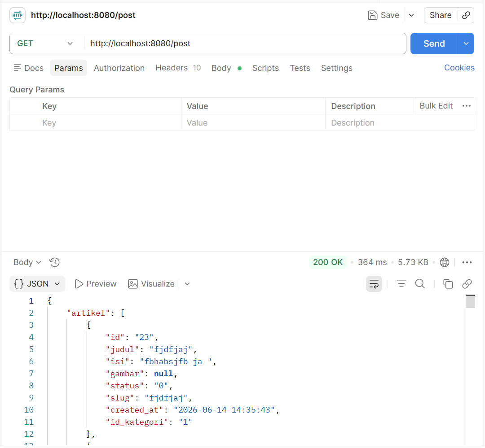

**b. Menampilkan Data Spesifik (GET by ID)**
Request `GET` ke `http://localhost:8080/post/{id}` berhasil mengembalikan satu data artikel sesuai ID yang diminta dengan status `200 OK`.

**Screenshot GET data spesifik:**
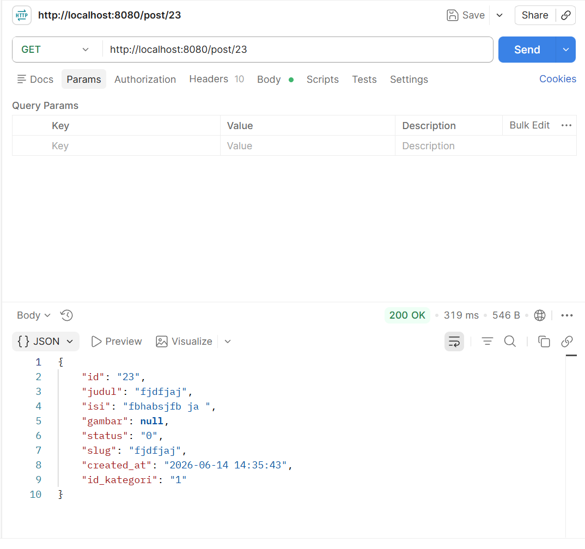

**c. Menambah Data Baru (POST)**
Request `POST` ke `http://localhost:8080/post` dengan *body* berisi `judul` dan `isi` berhasil menyimpan data baru ke database dan mengembalikan status `201 Created` beserta pesan sukses dalam JSON.

**Screenshot POST tambah data:**
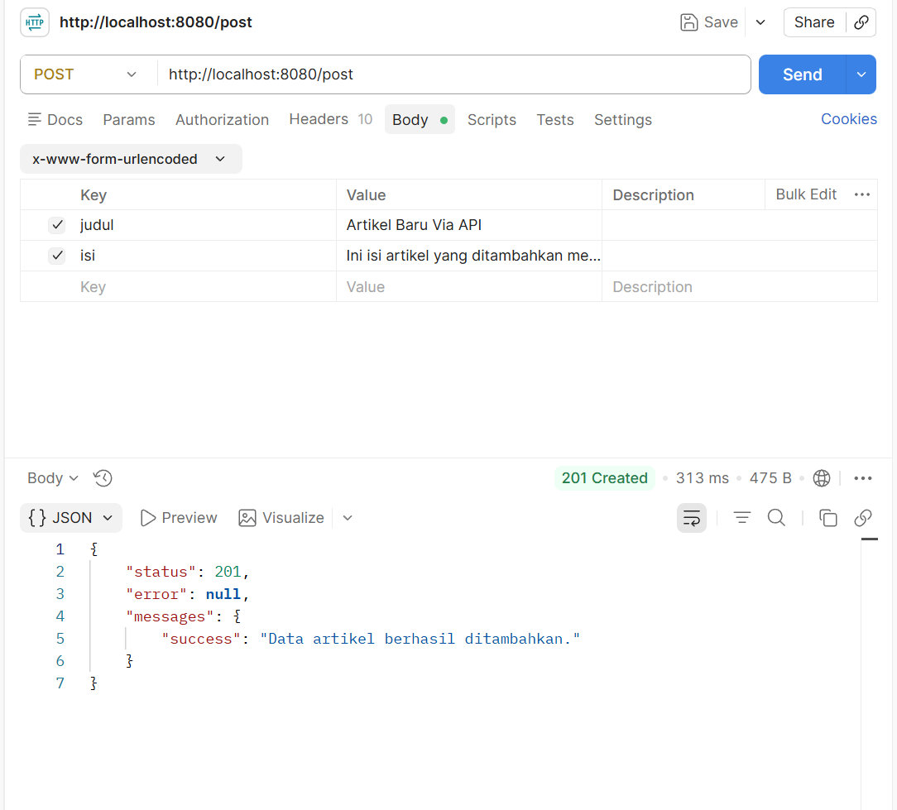

**d. Mengubah Data (PUT)**
Request `PUT` ke `http://localhost:8080/post/{id}` dengan *body* berisi data yang diperbarui berhasil mengubah data artikel di database dan mengembalikan status `200 OK` beserta pesan konfirmasi.

**Screenshot PUT ubah data:**
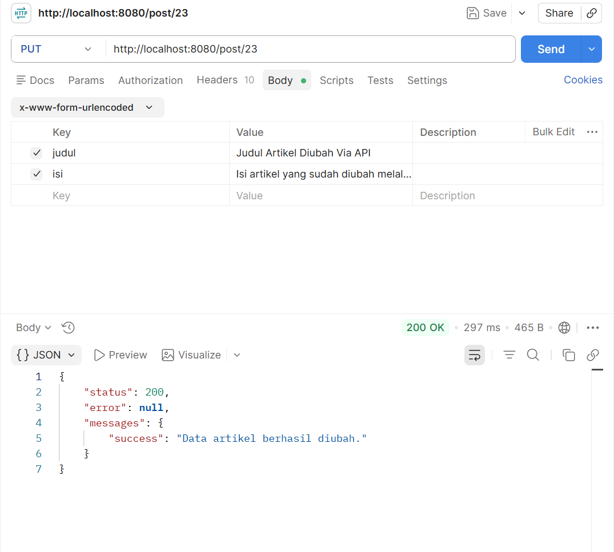

**e. Menghapus Data (DELETE)**
Request `DELETE` ke `http://localhost:8080/post/{id}` berhasil menghapus artikel dari database dan mengembalikan status `200 OK` beserta pesan konfirmasi penghapusan.

**Screenshot DELETE hapus data:**
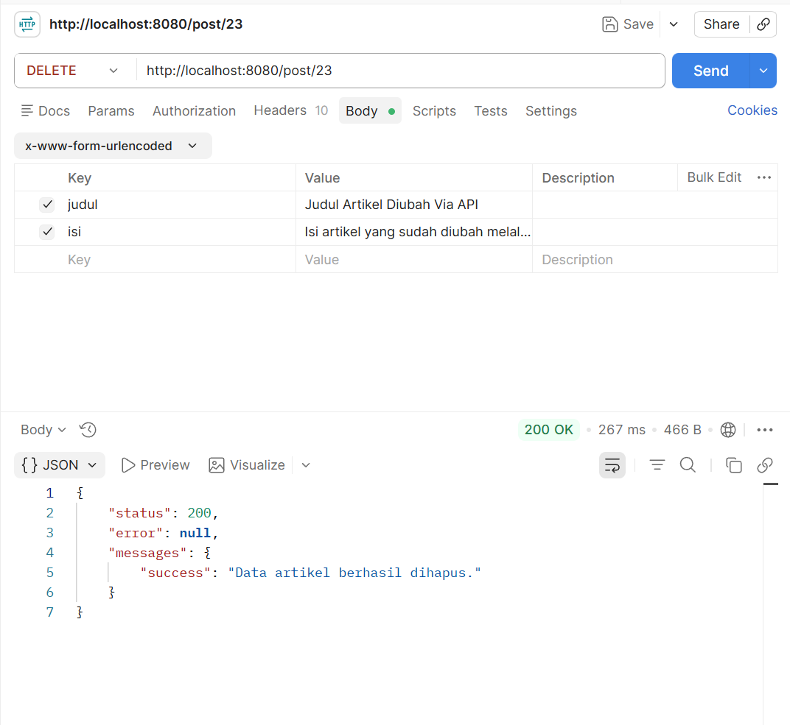

### 5. Konsep HTTP Method dalam REST API
Praktikum ini mempertegas pemahaman tentang konvensi penggunaan HTTP Method dalam arsitektur REST:

| HTTP Method | Endpoint | Fungsi |
|-------------|----------|--------|
| GET | /post | Mengambil semua data |
| GET | /post/{id} | Mengambil satu data |
| POST | /post | Menambah data baru |
| PUT | /post/{id} | Mengubah data |
| DELETE | /post/{id} | Menghapus data |

## Praktikum 11: Implementasi Frontend dengan VueJS 3

**Konsep dan Tujuan Utama:**
Praktikum ini merupakan kelanjutan dari Praktikum 10, dengan fokus pada pembuatan **Frontend** menggunakan framework JavaScript modern, yaitu **VueJS 3**. Jika pada Praktikum 10 kita membangun *backend* berupa REST API menggunakan CodeIgniter 4, maka pada praktikum ini kita membangun sisi *client* (antarmuka pengguna) yang mengonsumsi API tersebut. Konsep ini dikenal sebagai arsitektur **Decoupled** atau pemisahan *frontend* dan *backend*, di mana keduanya berkomunikasi secara eksklusif melalui pertukaran data JSON. Hasilnya adalah aplikasi web yang lebih modern, responsif, dan mudah dikembangkan secara terpisah oleh tim yang berbeda.

Berikut adalah penjelasan dari setiap tahapan yang dilakukan selama praktikum:

### 1. Persiapan Project dan Struktur Direktori
Project VueJS dibuat secara manual (tanpa npm/build tools) dengan memanfaatkan **CDN** (*Content Delivery Network*). Dua library utama dimuat langsung dari CDN:

* **VueJS 3** (`vue.global.js`) — Framework JavaScript utama untuk membangun antarmuka yang reaktif.
* **Axios** (`axios.min.js`) — Library HTTP client untuk melakukan request ke REST API dengan sintaks yang lebih sederhana dibanding `fetch` bawaan browser.

Struktur folder project dibuat di dalam direktori `htdocs` dengan nama `lab8_vuejs`, berisi satu file `index.html` sebagai halaman utama, serta folder `assets` yang di dalamnya terdapat `css/style.css` untuk tampilan dan `js/app.js` untuk seluruh logika aplikasi.

### 2. Konfigurasi CORS pada Backend CI4
Sebelum frontend dapat berkomunikasi dengan API, diperlukan konfigurasi **CORS** (*Cross-Origin Resource Sharing*) pada sisi backend CI4. CORS adalah mekanisme keamanan browser yang memblokir request dari *origin* berbeda (misalnya `localhost` ke `localhost:8080`). Untuk mengatasinya, dibuat filter baru bernama `Cors.php` di direktori `app/Filters/` yang menambahkan header `Access-Control-Allow-Origin: *` pada setiap response. Filter ini kemudian didaftarkan di `app/Config/Filters.php` dan diterapkan pada route `post` di `app/Config/Routes.php`, termasuk menangani *preflight* request dengan method OPTIONS.

### 3. Struktur Aplikasi VueJS (`app.js`)
Seluruh logika aplikasi dibangun menggunakan **Vue Instance** yang di-*mount* ke elemen `#app` di HTML. Instance ini memiliki tiga bagian utama:

* **`data()`** — Menyimpan state aplikasi secara reaktif, meliputi: array `artikel` untuk menampung data dari API, objek `formData` untuk menampung input form (id, judul, isi, status), boolean `showForm` untuk mengontrol visibilitas modal form, string `formTitle` untuk judul form dinamis, dan array `statusOptions` untuk pilihan dropdown status.

* **`mounted()`** — Hook siklus hidup Vue yang dipanggil otomatis saat komponen pertama kali dimuat. Di sini fungsi `loadData()` dipanggil untuk langsung mengambil data dari API saat halaman dibuka.

* **`methods()`** — Kumpulan fungsi yang menangani seluruh interaksi pengguna, dijelaskan pada poin berikutnya.

### 4. Implementasi Operasi CRUD via REST API

Seluruh operasi data dilakukan tanpa perpindahan halaman menggunakan Axios:

* **`loadData()`** — Mengirim request `GET` ke endpoint `/post` dan menyimpan array artikel yang diterima ke dalam `data.artikel`. VueJS secara otomatis memperbarui tampilan tabel karena data bersifat reaktif.

* **`tambah()`** — Menampilkan modal form dalam kondisi kosong dengan judul "Tambah Data", siap untuk menerima input artikel baru.

* **`edit(data)`** — Menerima objek artikel yang diklik, lalu mengisi `formData` dengan data tersebut dan menampilkan modal form dengan judul "Ubah Data". Pengguna dapat langsung melihat data lama dan mengubahnya.

* **`saveData()`** — Fungsi tunggal yang menangani penyimpanan untuk dua kondisi sekaligus. Jika `formData.id` terisi (mode edit), maka dikirim request `PUT` ke `/post/{id}`. Jika `formData.id` kosong (mode tambah), maka dikirim request `POST` ke `/post`. Setelah berhasil, form direset dan `loadData()` dipanggil ulang untuk memperbarui tabel.

* **`hapus(index, id)`** — Menampilkan dialog konfirmasi browser. Jika dikonfirmasi, request `DELETE` dikirim ke `/post/{id}`. Data dihapus dari array lokal menggunakan `splice()` tanpa perlu memanggil ulang API, sehingga lebih efisien.

* **`statusText(status)`** — Fungsi pembantu yang mengkonversi nilai status dari angka (0/1) menjadi teks yang mudah dibaca ("Draft"/"Publish") untuk ditampilkan di tabel.

### 5. Tampilan Antarmuka (index.html & style.css)
Antarmuka dibangun menggunakan HTML murni dengan direktif Vue yang disematkan langsung:

* **`v-for`** — Digunakan untuk melakukan perulangan dan merender setiap baris tabel secara otomatis dari array `artikel`.
* **`v-if`** — Digunakan untuk menampilkan/menyembunyikan modal form berdasarkan nilai `showForm`.
* **`v-model`** — Menghubungkan elemen input form dengan `formData` secara dua arah (*two-way binding*), sehingga perubahan input langsung tercermin di data Vue.
* **`@click`** dan **`@submit.prevent`** — Menangani event klik dan submit form tanpa menyebabkan *reload* halaman.

### Screenshot Hasil Praktikum

**Output**
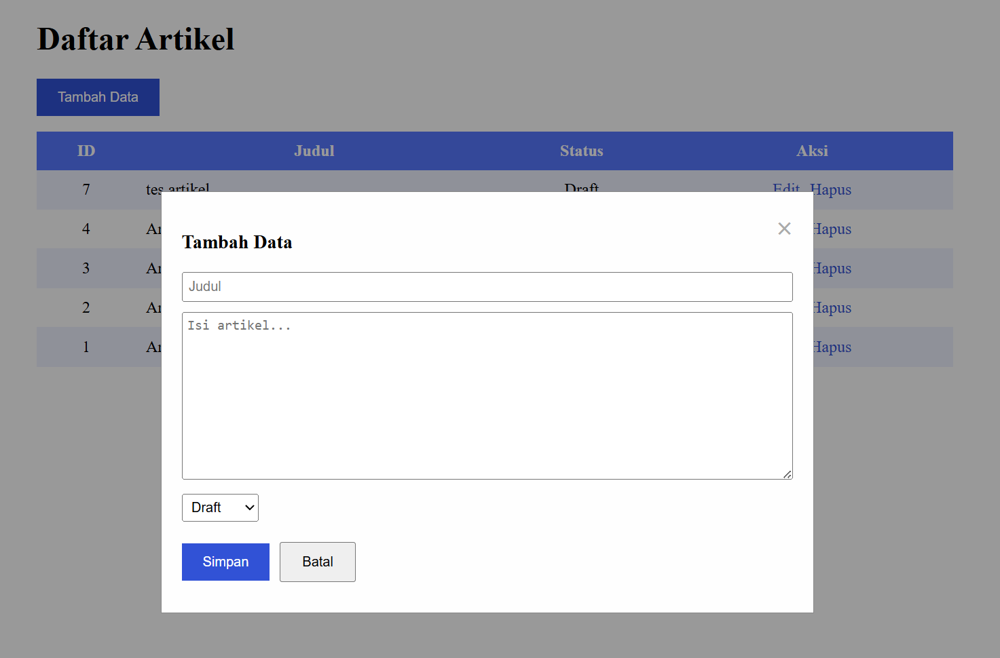

## Praktikum 12: VueJS Komponen dan Routing (Single Page Application)

**Konsep dan Tujuan Utama:**
Praktikum ini merupakan peningkatan dari Praktikum 11, dengan fokus pada penerapan dua konsep fundamental VueJS modern: **Vue Components** dan **Vue Router**. Pada praktikum sebelumnya, seluruh logika aplikasi ditulis dalam satu file `app.js` dan satu file `index.html`. Pendekatan ini tidak skalabel untuk aplikasi yang lebih besar. Dengan memecah aplikasi menjadi komponen-komponen terisolasi dan menambahkan sistem routing di sisi klien, aplikasi berevolusi menjadi sebuah **Single Page Application (SPA)** yang sesungguhnya — aplikasi web yang dapat berpindah antar halaman tanpa melakukan *reload* ke server sama sekali.

Berikut adalah penjelasan dari setiap tahapan yang dilakukan selama praktikum:

### 1. Penambahan Library Vue Router
Library **Vue Router 4** ditambahkan melalui CDN pada file `index.html`. Vue Router adalah library resmi VueJS yang menangani navigasi di sisi klien. Berbeda dengan navigasi web tradisional yang meminta halaman baru dari server setiap kali tautan diklik, Vue Router mencegat klik tersebut dan hanya mengganti komponen yang ditampilkan di dalam halaman, tanpa *reload*. Hasilnya adalah perpindahan antar halaman yang sangat cepat dan mulus.

### 2. Pemecahan Kode Menjadi Komponen
Struktur project diperluas dengan menambahkan folder `assets/js/components/` yang berisi tiga file komponen terpisah:

* **`Home.js`** — Komponen halaman beranda yang menampilkan pesan selamat datang dan daftar fitur aplikasi. Komponen ini bersifat statis dan tidak memerlukan koneksi ke API.

* **`Artikel.js`** — Komponen yang memuat seluruh logika CRUD artikel yang sebelumnya ada di `app.js`. Dengan dipindah ke file tersendiri, komponen ini menjadi unit yang terisolasi dan dapat digunakan kembali (*reusable*). Komponen ini memiliki `data()`, `mounted()`, dan `methods()` sendiri yang lengkap untuk mengelola state dan interaksi dengan REST API.

* **`About.js`** — Komponen baru yang dibuat sebagai tugas tambahan, menampilkan halaman profil pembuat aplikasi lengkap dengan nama, NIM, kelas, program studi, dan universitas dalam tampilan yang rapi.

### 3. Konfigurasi Vue Router di `app.js`
File `app.js` diubah total fungsinya — dari tempat logika aplikasi menjadi tempat konfigurasi dan inisialisasi aplikasi. Di sini didefinisikan tabel routing yang memetakan setiap URL ke komponen yang sesuai:

* `'/'` → komponen `Home`
* `'/artikel'` → komponen `Artikel`
* `'/about'` → komponen `About`

Router dibuat menggunakan `createWebHashHistory()` yang memanfaatkan karakter `#` pada URL (contoh: `localhost/lab8_vuejs/#/artikel`). Mode hash dipilih karena tidak memerlukan konfigurasi server tambahan dan bekerja langsung di lingkungan XAMPP.

### 4. Modifikasi Layout Utama (`index.html`)
File `index.html` diubah menjadi *master layout* yang hanya berisi kerangka tetap aplikasi. Dua elemen kunci Vue Router ditambahkan:

* **`<router-link>`** — Pengganti tag `<a>` biasa untuk navigasi antar halaman. Vue Router secara otomatis menambahkan class `router-link-exact-active` pada tautan yang sedang aktif, sehingga menu yang dipilih dapat diberi gaya CSS berbeda (warna biru aktif).

* **`<router-view>`** — Elemen penampung dinamis yang akan digantikan oleh komponen sesuai route yang aktif. Inilah inti dari SPA — hanya bagian ini yang berubah saat navigasi, bukan seluruh halaman.

### 5. Tambahan Halaman About (Tugas)
Sebagai tugas tambahan, dibuat komponen `About.js` baru dengan route `/about` dan tautan navigasi di menu atas. Halaman ini menampilkan identitas pembuat aplikasi: **Afdhal Agislam**, NIM **312410445**, Kelas **I241E**, Program Studi Teknik Informatika, Universitas Pelita Bangsa.

### Screenshot Hasil Praktikum

**Halaman Beranda**
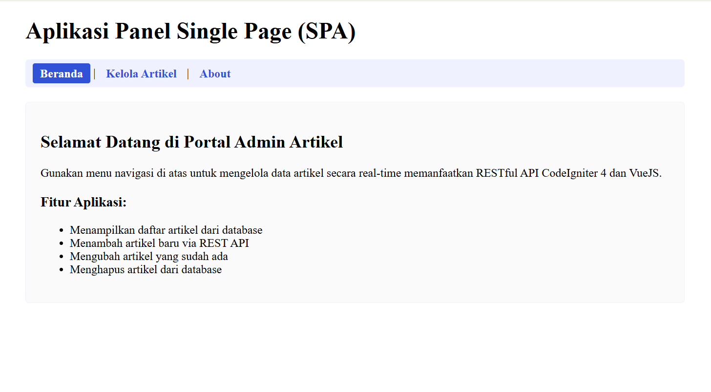

**Halaman Kelola Artikel**
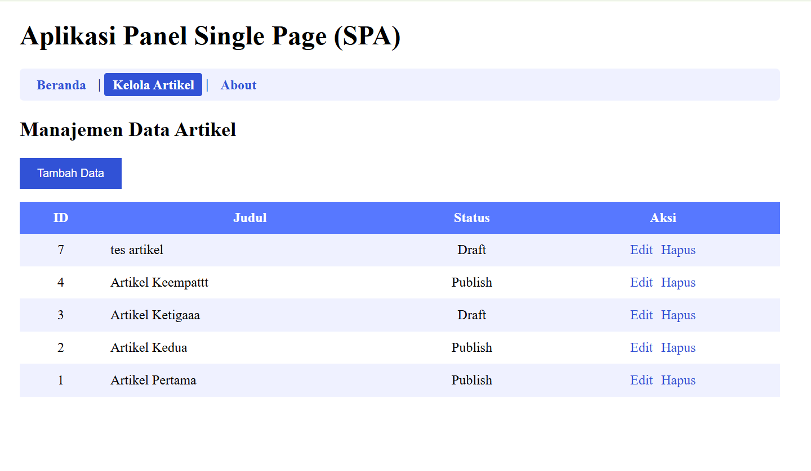

**Halaman About**
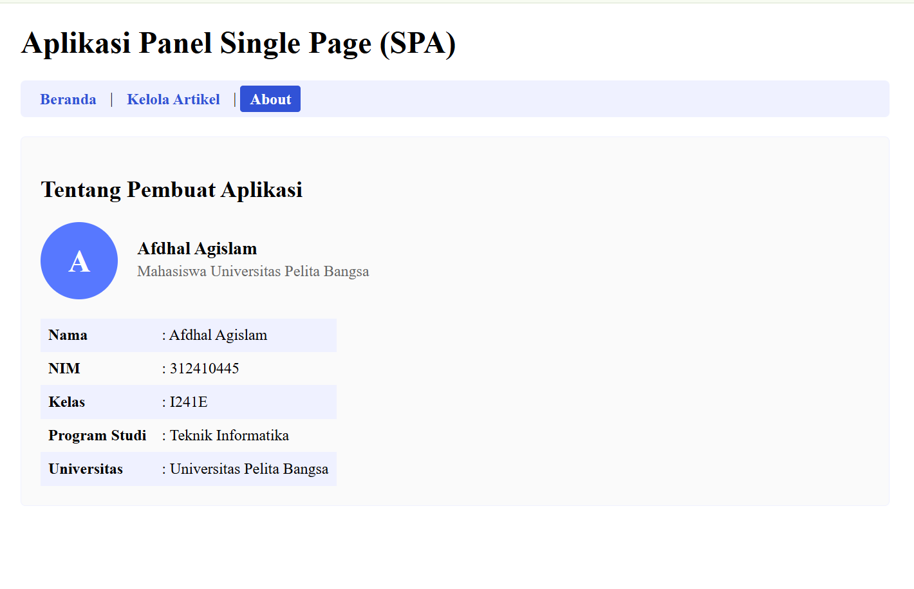


## Screenshot Hasil Praktikum 1-9

---

### Layout Sederhana dengan CSS
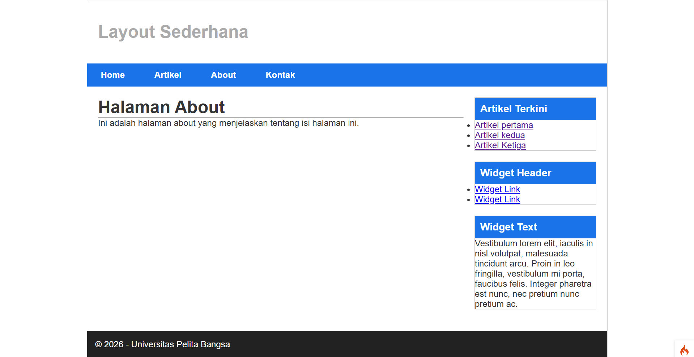

### Tampilan Daftar Artikel (Publik)
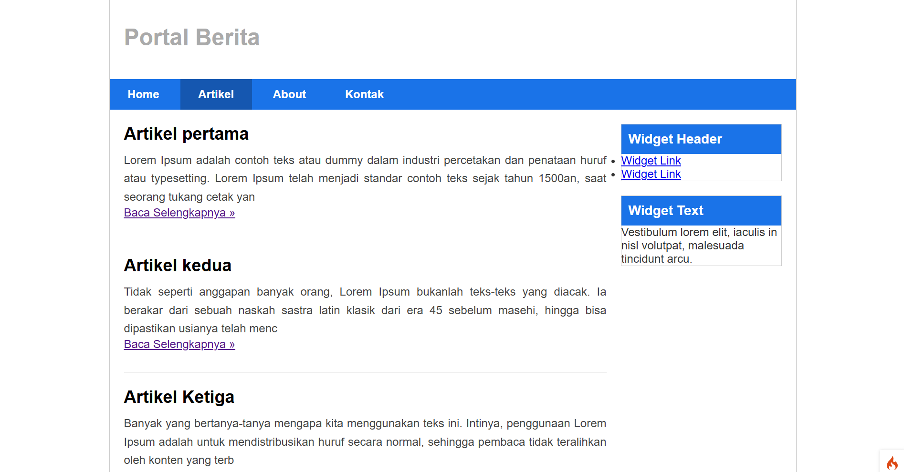

### Tampilan Detail Artikel
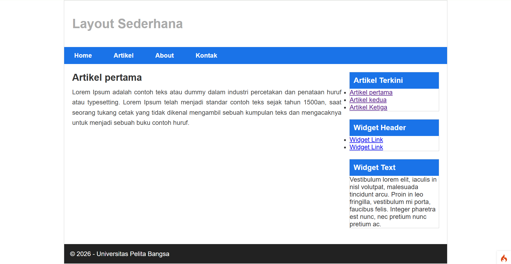

### Halaman Admin - Daftar Artikel
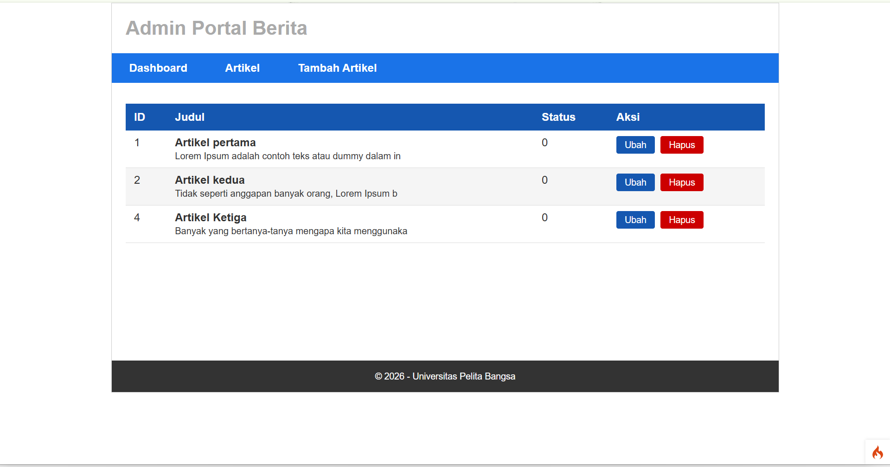

### Halaman Admin - Tambah Artikel
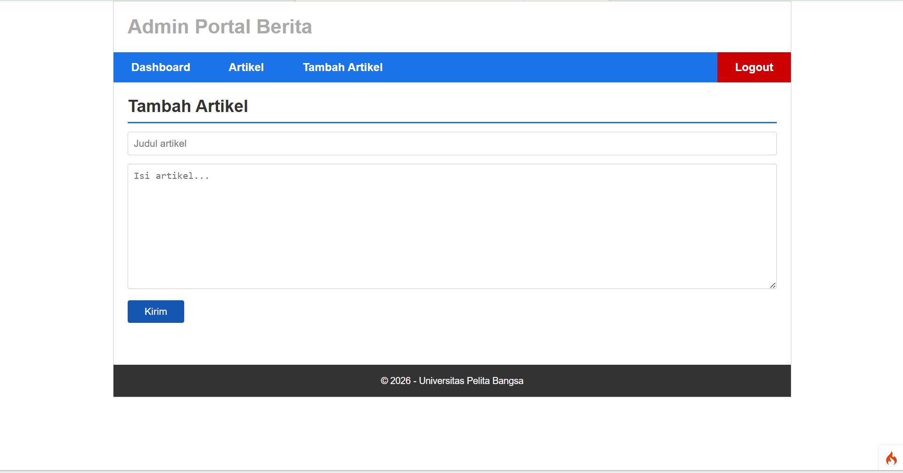

### Halaman Admin - Edit Artikel**
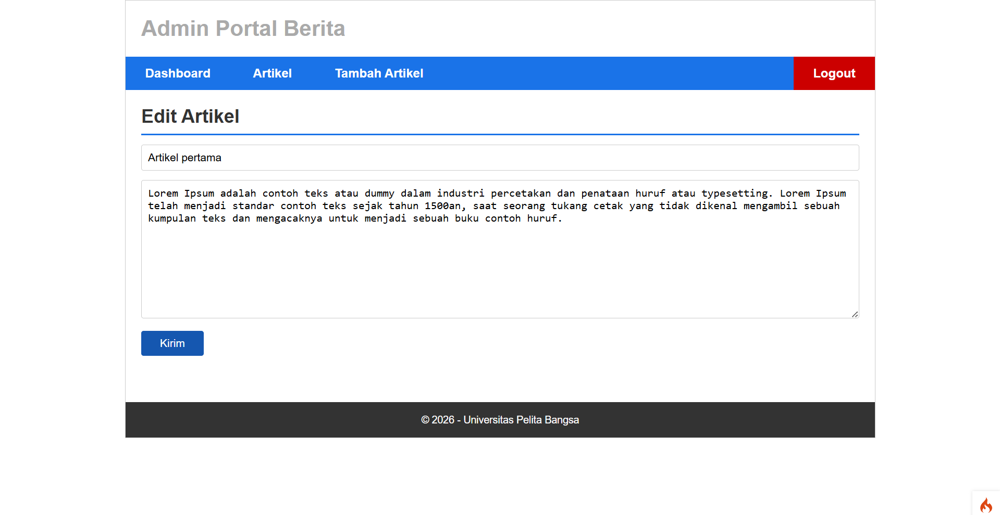

### Halaman Login
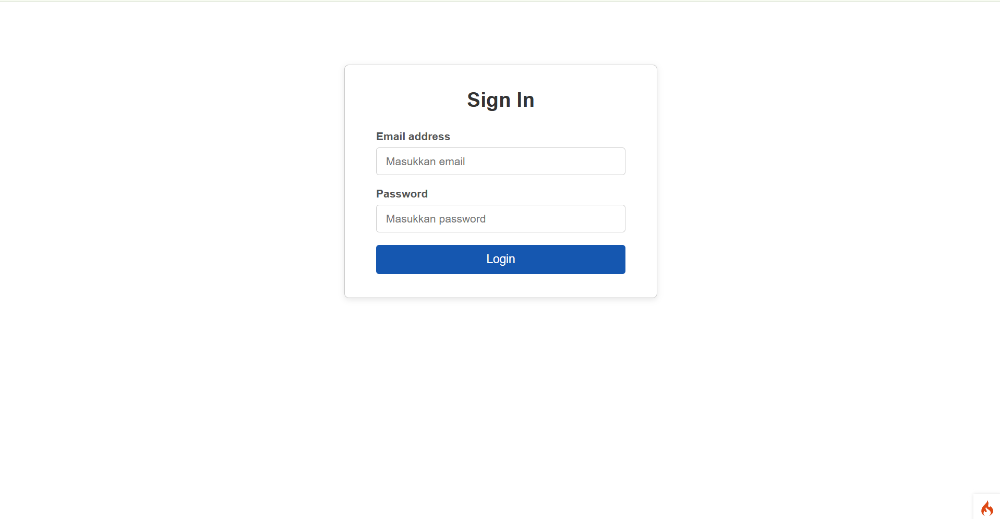

### Halaman Fitur Pencarian
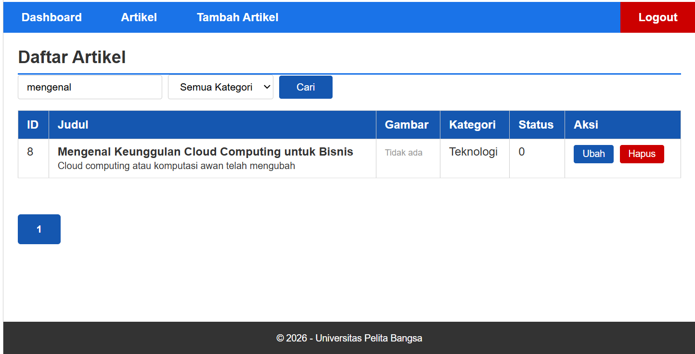

### Halaman Fitur Pagination
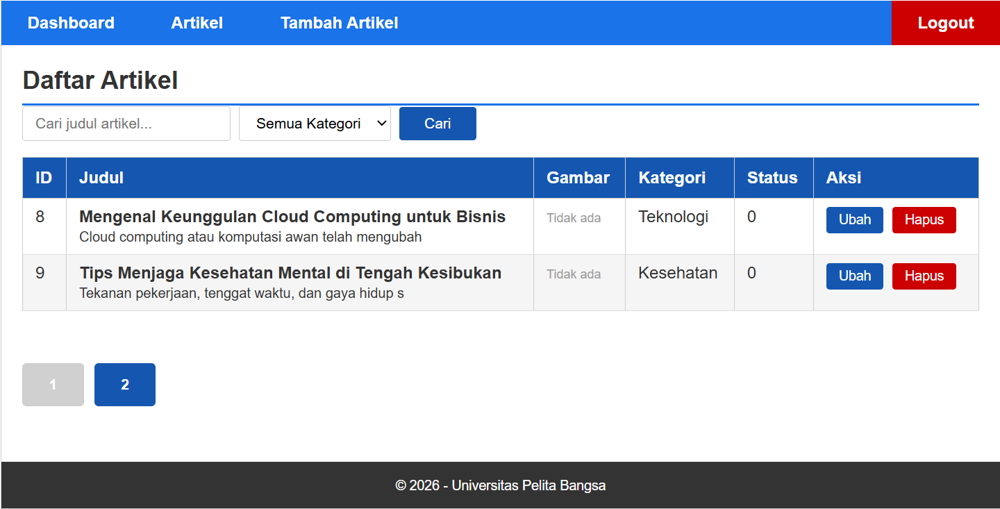

### Halaman Kategori
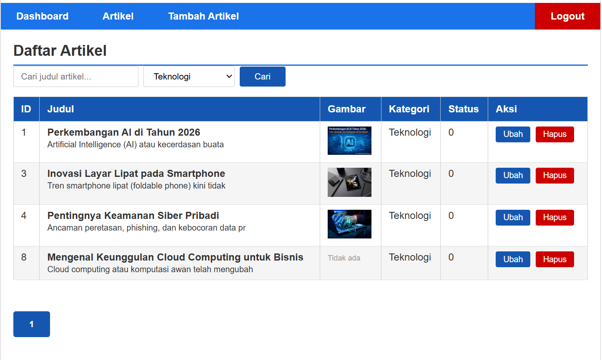

### Halaman Upload Gambar
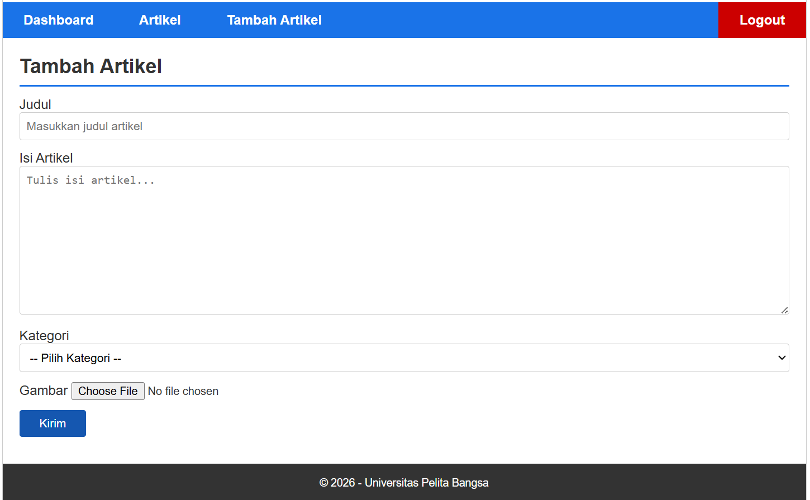

### Halaman Daftar Artikel New
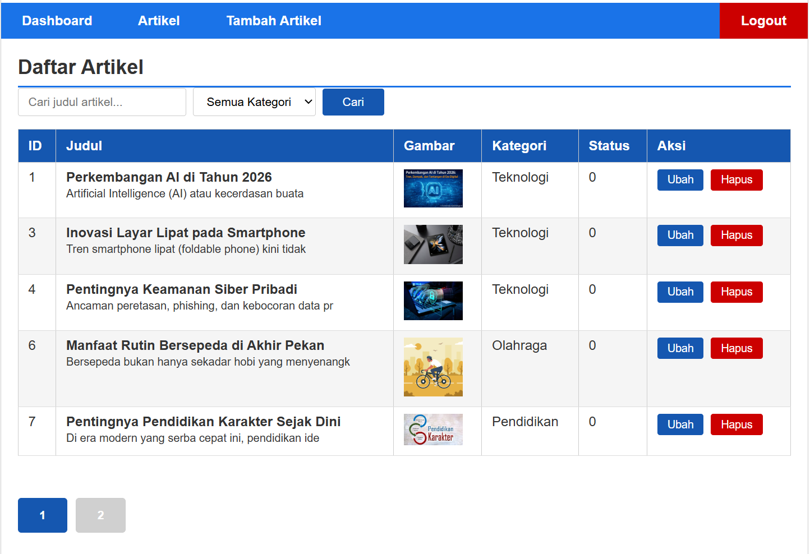

### Tampilan Hasil Praktikum 9
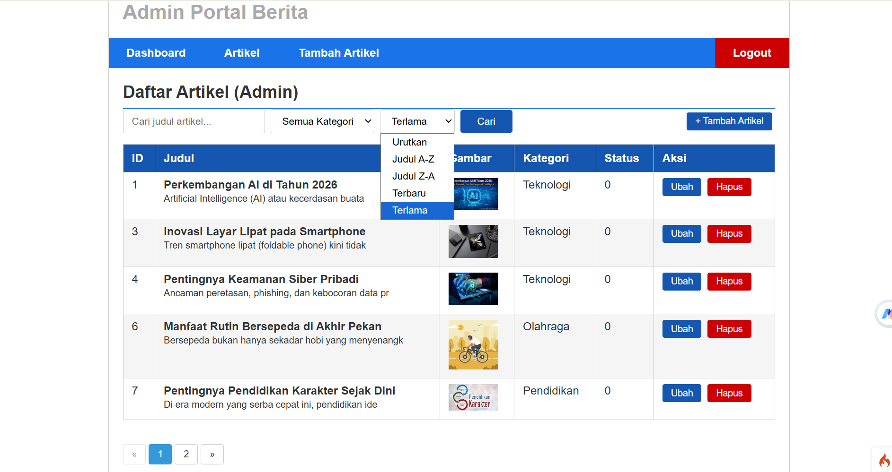


